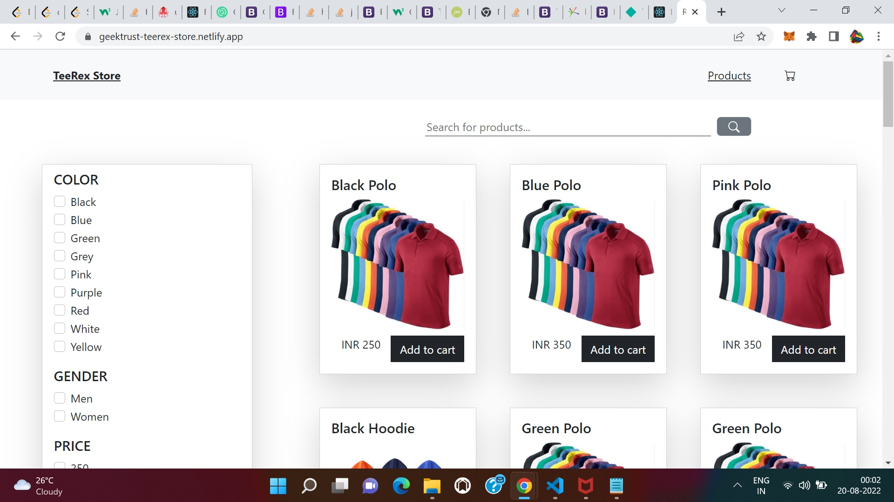

# Geektrust Code Challenge

[Geektrust Code Challenge Link](https://www.geektrust.com/coding/detailed/teerex-store)

This project is bootstrapped with [Create React App](https://github.com/facebook/create-react-app). I have used [React Testing Library](https://testing-library.com/docs/react-testing-library/intro/) and [Bootstrap](https://getbootstrap.com/) also in this project. And React Context API is used for state management

[Live Site Link](https://geektrust-teerex-store.netlify.app/)

### Result

1. Store desktop view
   

2. Store product with filter applied
   

3. Store product with search filter
   

4. Store product with filter + serch
   

5. Add product to cart
   

6. Cart view in desktop
   

7. Mobile view/Responsive view
   

8. Cart view in mobile
   

9. Code Coverage 80+
   

## Available Scripts

In the project directory, you can run:

### `npm start`

Runs the app in the development mode.\
Open [http://localhost:3000](http://localhost:3000) to view it in your browser.

The page will reload when you make changes.\
You may also see any lint errors in the console.

### `npm test`

Launches the test runner in the interactive watch mode.\
See the section about [running tests](https://facebook.github.io/create-react-app/docs/running-tests) for more information.

### `npm run build`

Builds the app for production to the `build` folder.\
It correctly bundles React in production mode and optimizes the build for the best performance.

The build is minified and the filenames include the hashes.\
Your app is ready to be deployed!
